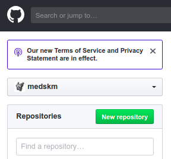
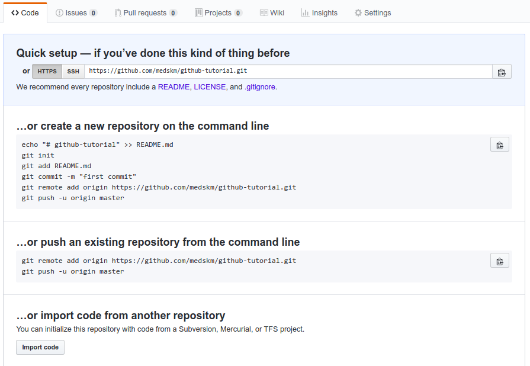
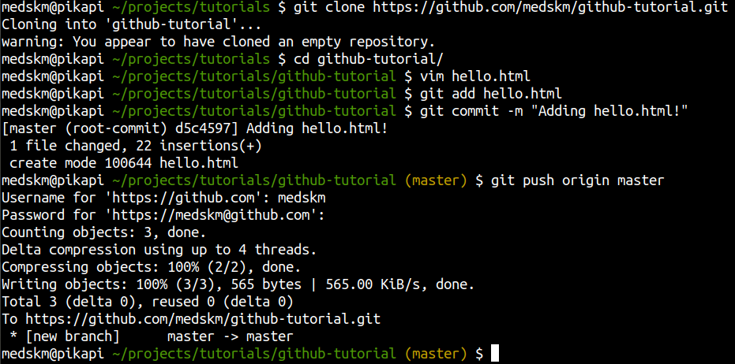
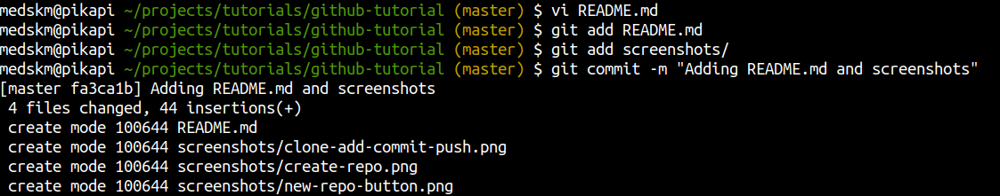

# Git Exploration Session

## What is Git?

Git is a tool for managing your code projects. 

### Github is to Code Files as Google Drive is to Documents...
If you've used cloud storage software like Google Drive, Box, DropBox, etc. 
to save and share documents, you will probably quickly recognize similarities
with Github or Gitlab (which are sites that host your code repositories).

Similar to Google Drive (and related tools), the most common use cases of Github are:
* Save versions of your programming work online so you can work on it across multiple
  computers
* Share and collaborate on code projects (you are not allowed to put your homework assignments in
  a public Github repository though, unless otherwise specified)
  * Code collaboration is common at internships, peer programming projects, hackathons,
    and online code portfolios to link in your resume
* Manage "versions" of your code and easily revert back to a previous version whenever
  needed

## How to use Git
This tutorial will use Git with Github. You can follow the directions on [github.com](https://github.com) to
create an account and create a new repository. Your main page on github.com will show a button
to create a New Repository:

Once you create a repository on github.com, 
you will get a page with tips on how to "clone" it on your computer for offline work:

Here is an example of cloning this public repository, adding my first file (`hello.html`)
commiting my work with a summary message, and pushing my commit to github.com so others can
access it on github.com (or alternatively, so I can clone the repo on another computer
when needed).

While you don't need to know the other commands, `cd` is a command on the command line to
"change directory", since I need to go into the github-tutorial directory to access the
git repository code. `vim` is a tool on the command line that opens and text editor so 
I can quickly create a file (similar to Atom or Sublime).

Here's a second commit to push this `README.md` with the screenshots you've seen on this
tutorial!

